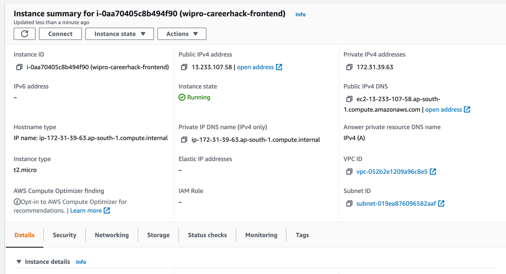
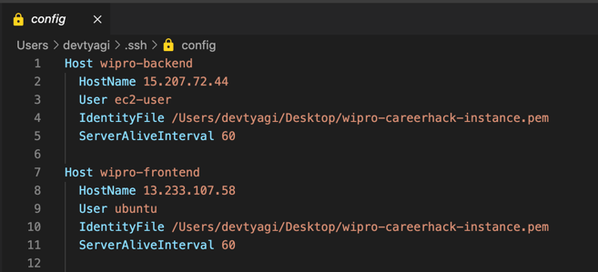
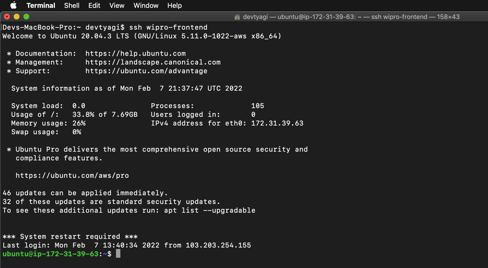
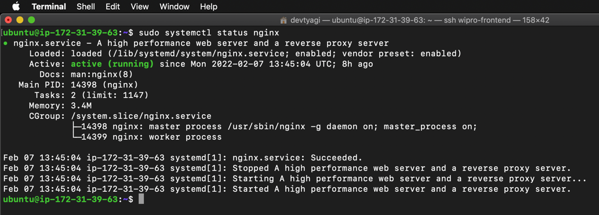
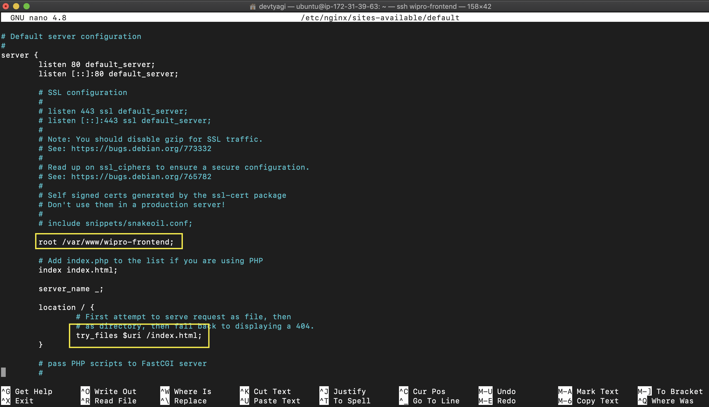

# WiproCareerHack-HackathonSubmission-Frontend

Minimal Frontend Interface as per the problem statement given in Wipro CareerHack [India]: Java Spring Boot + AWS challenge hosted by TopCoder.

https://www.topcoder.com/challenges/53963822-9016-400f-b418-6893463e5fb3

## Screens
- Dashboard ```/```
- Login ```/login```
- Create User Screen ```/create-user```
- Create Password Screen ```/activate```

# Deployment

The project has been deployed on an Amazon EC2 t2.micro instance. (Separate from the Backend Instance)

## Setup EC2

An Ubuntu EC2 instance has been set up, with inbound rules for SSH (Own IP) and HTTP traffic.



## Setting up SSH

SSH Config file has been edited for easy access.



Logging into the EC2 Instance using SSH



## Installing NPM and Node on the EC2

```
sudo apt update

sudo apt install nodejs
```

## Fetching the React App source code from GitHub

```
git pull https://github.com/devptyagi/WiproCareerHack-HackathonSubmission-Frontend.git
```

## Creating the Build Files

```
cd WiproCareerHack-HackathonSubmission-Frontend

npm i

npm run build
```

## Installing NGINX

```
sudo apt install nginx

sudo systemctl status nginx
```



## Configuring NGINX Server

Copy the build files from 'build' folder to a new folder in
/var/www/ directory.

```
mkdir /var/www/wipro-frontend

cp -r build/* /var/www/wipro-frontend/
```

Edit the default NGINX Config file to serve the /var/www/wipro-frontend/ directory.

```
sudo nano /etc/nginx/sites-available/default
```



## Restart NGINX

```
sudo systemctl restart nginx
```

## Done!

The front end has been deployed to the EC2 instance successfully!